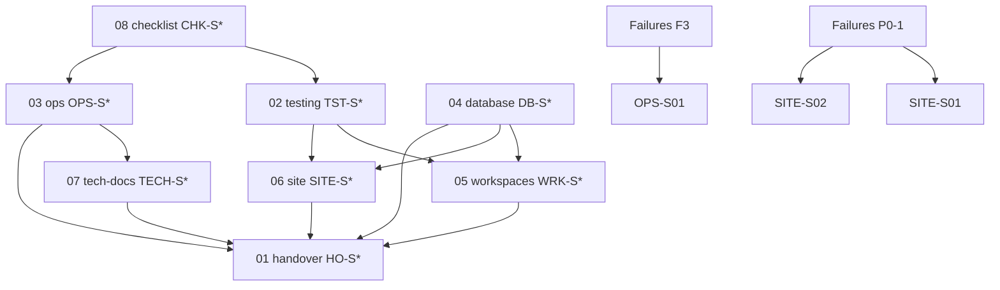

# Programme plans — master index

**AUDITED:** 2026-08-08 · **Structure:** microscopic vertical slices (TDD) · **Folder:** flat `plans/` only.

**Authority:** user instruction > live code > [`AGENTS.md`](../AGENTS.md) > this tree > [`01-handover.md`](./01-handover.md).

Navigation: [`README.md`](./README.md) · Blockers: [`Failures.md`](../Failures.md) · Handover: [`01-handover.md`](./01-handover.md).

---

## TDD loop (3 lines)

1. **Confirm seam** with owner (checkbox in slice) before writing any test.
2. **Red → green:** one seam, one failing test, one minimal implementation — tracer bullet; no horizontal “all tests then all impl”.
3. **Refactor** only after review — not inside the red/green loop.

Anti-patterns forbidden: implementation-coupled tests, tautological tests, horizontal slicing. See TDD skill + [`Agents/02-testing.md`](../Agents/02-testing.md).

---

## Current gate commands (from [`AGENTS.md`](../AGENTS.md))

| When | Command |
|------|---------|
| Before completion | `pnpm run check:layout` |
| Fast ship gate | `pnpm run gate` (`release:gate:fast`) |
| Full ship gate | `pnpm run release:gate` |
| Fork isolation | `pnpm run scan:boundaries` |
| Both Vitest lanes | `pnpm run test` |
| P0 unit slice | `pnpm run p0:unit` |
| CSS | `pnpm run verify:focss` · `lint:ui:strict` · `check:composer-styles` · `check:style-tokens` |
| Plans purity | `node scripts/general/check-plans-purity.mjs` |
| Migrations dry | `pnpm run ops db:apply -- --dry` · `pnpm run ops db:apply:admin -- --dry` |
| Types | `pnpm run ops db:types:admin` · `pnpm run ops db:types` |

All commands from **repo root** (`e:\oo08082026`). Browser / Playwright: **`http://localhost:3000` only** (never `127.0.0.1`).

---

## Dependency graph



---

## Seams glossary

| Seam ID | Public boundary | Typical test layer |
|---------|-----------------|-------------------|
| `SEAM-GATE-TYPECHECK` | `pnpm run typecheck` exit code | — |
| `SEAM-GATE-P0UNIT` | `pnpm run p0:unit` → `results/tests/vitest-p0-results.json` | Vitest |
| `SEAM-GATE-FULL` | `pnpm run gate` exit code | composite |
| `SEAM-GATE-LANES` | `pnpm run test` → `results/tests/summary.json` (2 lanes) | Vitest |
| `SEAM-R2-BUCKET` | `resolveCatalogBucketName()` in `site/lib/storage/r2Catalog.ts` | Vitest `r2Catalog.test.ts` |
| `SEAM-CLIENT-IP` | `normalizeClientIp()` in `site/lib/clientIp.ts` | Vitest `clientIp.test.ts` |
| `SEAM-ASSET-PATH` | `normalizeAssetPath(..., { probeDisk })` in `site/lib/assetPaths.ts` | Vitest `assetPaths.test.ts` |
| `SEAM-PLAYWRIGHT-REPORT` | Playwright HTML → `results/playwright-report/`; root `playwright-report/` gitignored | Vitest `root-configs.test.ts` |
| `SEAM-E2E-PLANNER-3B` | `tests/e2e/audit-3b-planner-fixes.spec.ts` @ `http://localhost:3000/ooplanner` | Playwright |
| `SEAM-E2E-STUDIO-2A` | `tests/e2e/audit-2a-studio-journey.spec.ts` @ `/oostudio` | Playwright |
| `SEAM-E2E-MARKETING-4A` | `tests/e2e/audit-4a-marketing-journey.spec.ts` @ `/` | Playwright |
| `SEAM-CONSOLE-ROUTE` | Browser console on route (no hydration error text) | Playwright + `results/console-audit/` |
| `SEAM-OPS-CURL` | `curl.exe -sI` response headers/body | manual / script |
| `SEAM-DB-TYPES-ADMIN` | `pnpm run ops db:types:admin` → `site/platform/types/database.admin.types.ts` | ops + `typecheck` |
| `SEAM-DB-TYPES-PRODUCTS` | `pnpm run ops db:types` → `site/platform/types/database.types.ts` | ops (needs linked Supabase CLI) |
| `SEAM-TECH-SNAPSHOT` | `tests/tech-docs-generator/snapshot.test.ts` | Vitest tech-docs lane |
| `SEAM-SESSION-CLOSE` | Dated artifacts in `results/` + handover slice table updated | — |

---

## Slice registry (all programmes)

| Slice ID | Plan | Seam / focus | Priority | Status |
|----------|------|--------------|----------|--------|
| HO-S01 | 01 | `SEAM-GATE-P0UNIT` evidence on close | — | DONE |
| HO-S02 | 01 | `Failures.md` row removal only with evidence | — | DONE |
| HO-S03 | 01 | Plan `AUDITED` date bump | — | DONE |
| HO-S04 | 01 | `check-plans-purity` | — | DONE |
| HO-S05 | 01 | `activeBlockers.ts` mirror | — | DONE |
| HO-S06 | 01 | Handover status table | — | PARTIAL |
| TST-S01 | 02 | `SEAM-GATE-TYPECHECK` | — | DONE |
| TST-S02 | 02 | `typecheck:tests` | — | DONE |
| TST-S03 | 02 | `SEAM-GATE-P0UNIT` | — | DONE |
| TST-S04 | 02 | `audit-hollow-tests.mjs` | — | DONE |
| TST-S05 | 02 | `audit-gate-skips.mjs` | — | DONE |
| TST-S06 | 02 | Vitest default lane | — | DONE |
| TST-S07 | 02 | Vitest tech-docs lane | — | DONE |
| TST-S08 | 02 | `test:coverage` ≥90% | — | DONE |
| TST-S09 | 02 | `SEAM-GATE-FULL` | — | DONE |
| TST-S10 | 02 | `scan:boundaries` | — | DONE |
| TST-S11 | 02 | `asset-cutover-smoke.mjs` | — | DONE |
| TST-S12 | 02 | `SEAM-R2-BUCKET` fail-closed | — | DONE |
| TST-S13 | 02 | `SEAM-PLAYWRIGHT-REPORT` | — | DONE |
| TST-S14 | 02 | `vitest-p0-results.json` separate | — | DONE |
| TST-S15 | 02 | Coverage strict 90% inventory | P1 | OPEN |
| TST-S16 | 02 | `SEAM-E2E-PLANNER-3B` full spec | P2 | OPEN |
| TST-S17 | 02 | `audit-3c-planner-polish.spec.ts` | P2 | OPEN |
| TST-S18 | 02 | `SEAM-E2E-STUDIO-2A` | P2 | OPEN |
| TST-S19 | 02 | `SEAM-E2E-MARKETING-4A` | P2 | OPEN |
| TST-S20 | 02 | Rate-limit IP `normalizeClientIp` | P1 | DONE |
| TST-S21 | 02 | `withAuth` test scope (no false `mirror:throw` stderr) | P1 | DONE |
| OPS-S01 | 03 | F3 `docs.oando.co.in` DNS | **P0** | OPEN |
| OPS-S02 | 03 | `check-worker-origin.mjs` | — | DONE |
| OPS-S03 | 03 | Apex `/api/categories/` JSON | — | DONE |
| OPS-S04 | 03 | Vercel `--prebuilt` + static CSS 200 | P0 | OPEN |
| OPS-S05 | 03 | Vercel token rotation | P1 | OPEN |
| OPS-S06 | 03 | Lockfile pnpm 11.20.0 | P1 | DONE |
| OPS-S07 | 03 | Apex `/ooplanner/` worker header | — | DONE |
| OPS-S08 | 03 | Apex catalog asset HEAD 200 | — | DONE |
| DB-S01 | 04 | `db:apply:admin --dry` | — | OPEN |
| DB-S02 | 04 | `feature_flags` grants → Planner | P0 | PARTIAL |
| DB-S03 | 04 | Asset cutover unit smokes | — | DONE |
| DB-S04 | 04 | `SEAM-DB-TYPES-ADMIN` | P1 | OPEN |
| DB-S05 | 04 | `SEAM-DB-TYPES-PRODUCTS` (CLI linked) | P1 | OPEN |
| DB-S06 | 04 | Contact DB smokes | P1 | PARTIAL |
| DB-S07 | 04 | Retire Products `furniture_catalog` | P1 | OPEN |
| DB-S08 | 04 | Planner Supabase persistence proof | P1 | OPEN |
| DB-S09 | 04 | Types UTF-8 / no BOM on write | — | DONE |
| DB-S10 | 04 | `db:test` connection smoke | — | OPEN |
| WRK-S01 | 05 | 3b fix #1 undo/grid | P0 | DONE |
| WRK-S02 | 05 | 3b fix #2 BOQ dock | P0 | DONE |
| WRK-S03 | 05 | 3b fix #3 390px place step | P0 | DONE |
| WRK-S04 | 05 | 3b fix #4 click/keyboard place | **P0** | DONE |
| WRK-S05 | 05 | 3b fix #5 toolbar handlers | — | DONE |
| WRK-S06 | 05 | 3b fix #6 Ctrl+K palette | — | DONE |
| WRK-S07 | 05 | 3b fix #7 Escape closes AI | — | DONE |
| WRK-S08 | 05 | 3b fix #8 refresh project name | — | OPEN |
| WRK-S09 | 05 | 3b Supabase mode (no bypass) | **P0** | OPEN |
| WRK-S10 | 05 | `SEAM-E2E-STUDIO-2A` | P2 | OPEN |
| WRK-S11 | 05 | `audit-3c` polish | P2 | OPEN |
| WRK-S12 | 05 | `scan:boundaries` on workspace edit | — | DONE |
| WRK-S13 | 05 | `responsive-audit.mjs` workspaces | P1 | OPEN |
| WRK-S14 | 05 | `PlannerProjectMenu` orphan decision | P2 | OPEN |
| SITE-S01 | 06 | `/products/workstations/` hydration | **P0** | DONE |
| SITE-S02 | 06 | `/products/seating/` hydration | **P0** | DONE |
| SITE-S03 | 06 | `/contact/` hydration | P1 | DONE |
| SITE-S04 | 06 | `/dashboard/` console clean | P1 | DONE |
| SITE-S05 | 06 | `/portal/` console clean | P1 | DONE |
| SITE-S06 | 06 | `/planning/` console clean | P1 | DONE |
| SITE-S07 | 06 | `/` marketing console clean | P1 | DONE |
| SITE-S08 | 06 | Assistant off-canvas @390px | P1 | OPEN |
| SITE-S09 | 06 | Assistant header overflow @390px | P1 | OPEN |
| SITE-S10 | 06 | `/trusted-by` abort | P1 | OPEN |
| SITE-S11 | 06 | Theme API (`/api/theme/active/` presets) | P1 | DONE |
| SITE-S12 | 06 | `responsive-audit.mjs` site | P1 | OPEN |
| SITE-S13 | 06 | `SEAM-E2E-MARKETING-4A` | P2 | OPEN |
| SITE-S14 | 06 | `verify:focss` on site CSS touch | — | DONE |
| SITE-S15 | 06 | i18n locale switch e2e | P1 | OPEN |
| SITE-S16 | 06 | Enquiry notification (ledger #10) | P1 | OPEN |
| SITE-S17 | 06 | Homepage empty headings (ledger #6) | P2 | OPEN |
| SITE-S18 | 06 | Image lazy-load scroll (ledger #7) | P2 | OPEN |
| TECH-S01 | 07 | `snapshot.test.ts` isolate artifact | P1 | PARTIAL |
| TECH-S02 | 07 | `pnpm --filter oando-tech-docs gate` | — | DONE |
| TECH-S03 | 07 | Tech-docs lane in `pnpm run test` | — | DONE |
| TECH-S04 | 07 | `activeBlockers.ts` ↔ `Failures.md` | — | DONE |
| TECH-S05 | 07 | Prod docs host after F3 | P0 | OPEN |
| TECH-S06 | 07 | Database boundaries page content | — | DONE |
| CHK-S01 | 08 | Repo root + `.env.local` | — | OPEN |
| CHK-S02 | 08 | `pnpm install` root only | — | OPEN |
| CHK-S03 | 08 | Fast gate quartet | — | OPEN |
| CHK-S04 | 08 | Read `Failures.md` + handover | — | OPEN |
| CHK-S05 | 08 | Dev server `localhost:3000` | — | OPEN |
| CHK-S06 | 08 | `scan:boundaries` | — | OPEN |
| CHK-S07 | 08 | DB awareness (two projects) | — | OPEN |
| CHK-S08 | 08 | Two Vitest lanes awareness | — | OPEN |
| CHK-S09 | 08 | Pre-commit docs + purity | — | OPEN |
| CHK-S10 | 08 | Pick programme slice from registry | — | OPEN |

**Totals:** 93 slices · **P0-labelled:** 12 (`OPS-S01`, `OPS-S04`, `DB-S02`, `WRK-S01`–`WRK-S04`, `WRK-S09`, `SITE-S01`, `SITE-S02`, `TECH-S05`).

Detail per slice: programme plan files below.

---

## Programme index

| Plan | Focus |
|------|--------|
| [02-testing-plan.md](./02-testing-plan.md) | Gates, Vitest, Playwright, hygiene |
| [03-ops-deploy-plan.md](./03-ops-deploy-plan.md) | Vercel, Worker, DNS, lockfile |
| [04-database-plan.md](./04-database-plan.md) | Admin + Products DB, types, assets |
| [05-workspaces-plan.md](./05-workspaces-plan.md) | Planner + Studio (fork isolation) |
| [06-site-plan.md](./06-site-plan.md) | Marketing, hydration, i18n |
| [07-tech-docs-plan.md](./07-tech-docs-plan.md) | Tech-docs generator + F3 |
| [08-oo-start-checklist.md](./08-oo-start-checklist.md) | Session start → slice IDs |

---

## Purity gate

```powershell
node scripts/general/check-plans-purity.mjs
```

**Expect:** `check:plans-purity OK` — `README.md` + `00-README.md` + eight programme docs, no subfolders, Markdown only.
